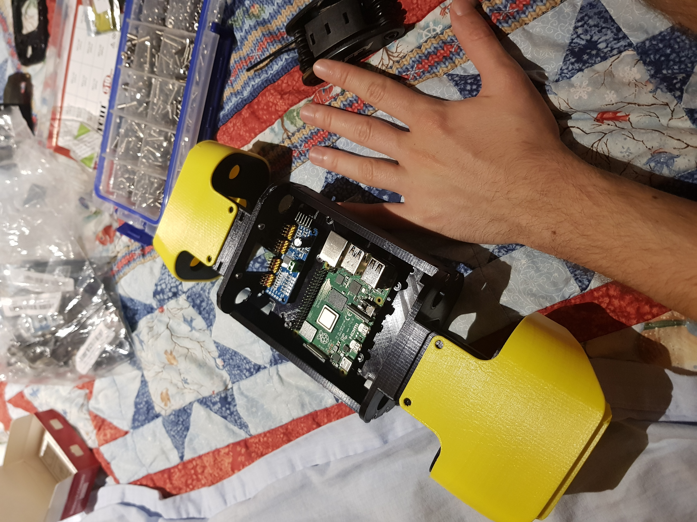
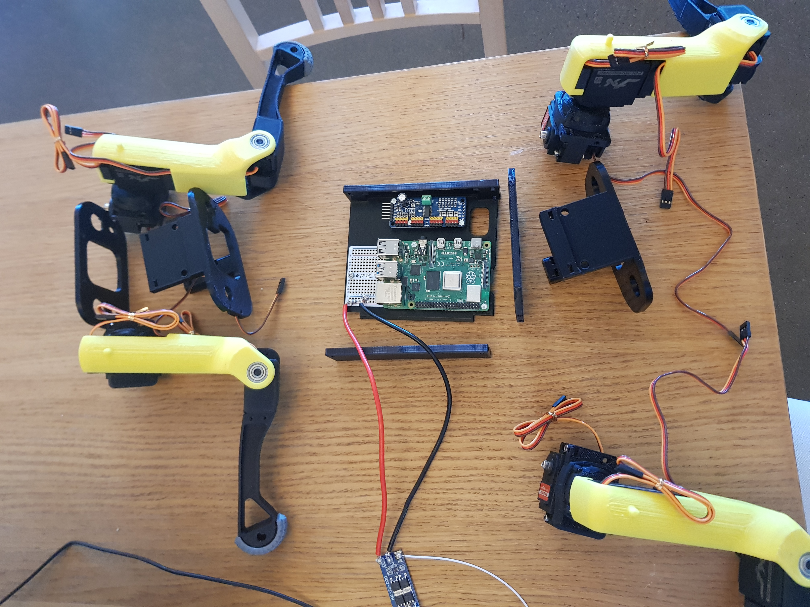
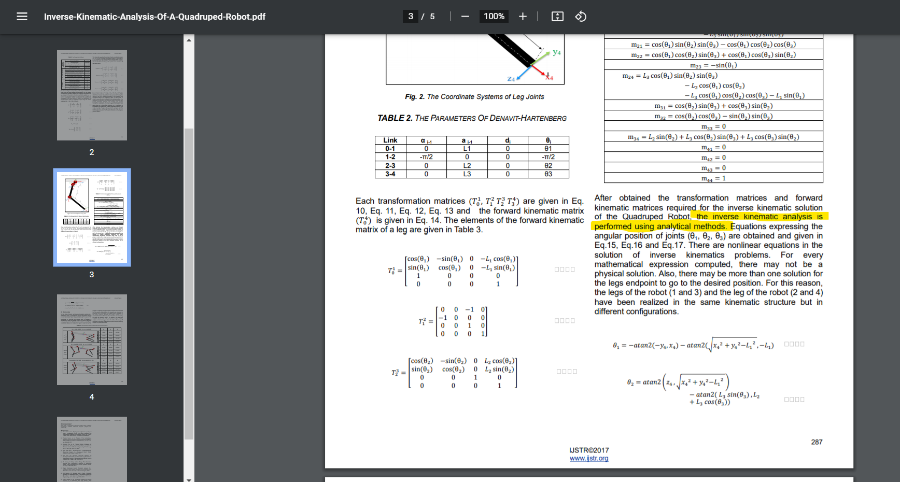

## Spot Micro Robot
This was a fun project where I 3d printed the robot, planned the hardware, assembled, and used a fellow robot builder's ROS Repo to get it walking. I contributed a bit to the robot builder's ROS repo as well. You can see a video demo [here](https://www.youtube.com/watch?v=g6FMSfrcahk).  
    

### Intro
Take a moment and touch your left shoulder and then move your mouse to the top left of your computer screen. What parts of your body moved to accomplish that task? If you do it again slowly, did you move your wrist? Your elbow? Your shoulder? Your torso? I assume that most of us moved multiple body parts in coordination, and I'd also assume that the force applied with your body parts was carefully controlled and that nobody broke their laptop.    

Now imagine you were programming a robot to do this task. Assuming you had a robot arm that had the same joints as your human arm, you'd have to move all of those joints in coordination, to a pretty high degree of precision and accuracy, and carefully control the force applied from the arm to objects in the real world so as to not break anything. For a human these tasks are intuitive. For a robot they can be complex to model. When programming Spot Micro, to acheive complicated motion like walking, sitting, and standing, I used code that Mike4192 published that implements kinematic modelling to command the robot in space and solve for these joint positions.    

### Presentation Plan
We'll talk about:
* The project and it's phases for me. This was the biggest and most complex thing I'd built to date.
* The software and Robot Operating System (ROS).
* Inverse kinematic models and how to coordinate movement across multiple joints.

### Project Phases
1. Planning Electronics
2. Gather Electronics
3. 3d Print Parts
4. Assemble hardware
5. Integrate Software

### Timeline
August 2020  
* Thoroughly read documentation
* Planned Electronics
* Planned which 3d Models to Use
* Ordered 14 Servos from Bangood  

September 2020
* Banggood servo order delayed due to no supply, I cancelled in response
* Re-ordered servos from Aliexpress
* Miscellaneous other orders from Bangood, Aliexpress, and Amazon for other parts
* Started 3d Printing parts 
  * Printed Chasis
  * Printed some leg pieces (later realized they were misprinted, and had to re-print them)
* Assembled an Arduino-based Controller
* Gathered most of the other electronics (except Servos)

October 2020
* Received some servos. Order was half the servos I ordered, half another type of (cheaper) servos that didn't meet my specifications. Began negotiations with Aliexpress and Seller for refund
* Ordered 4 servos from a different Aliexpress seller, paying for fast shipping, expecting Aliexpress dispute process on other order to result in a partial refund
* Started to assemble legs, with the limited servos I had
* had initial hardware trouble with legs and ended up cutting one open to extract the servo. Learned to glue nuts in place so that they don't rotate with screw when extracating

November 2020
* Tested power system
* Continued with leg assembly
* Was able to do hardware tests with power
* Promptly broke a servo. Unfortunately I only had the exact number I needed, so I then needed to order more. Given the horror, I order some from Amazon and paid for shipping $$$
* Continued assembly and hardware testing
* 1st contribution to Mike4192's spotMicro repository 

December 2020
* Received Servos from Amazon
* Settled dispute with Aliexpress. Worked out as expected, but seller was of no hope, it was Aliexpress that helped
* Continued assembly, got to a point where could test with power again
* Sprinted through config and testing to meet Dec 31st goal of walking
* Tested a Lidar I received for Christmas, but in isolation, not with Spot Micro
* Acheived goal of walking 

### Planning the Electronics
Before you can buy parts, you have to decide what parts you need! This involved looking through various pieces of documentation [here,](https://spotmicroai.readthedocs.io/en/latest/gettingStarted/) and planning out my electronics.  
Here is an early plan of my electronics circuit, though I didn't use a breadboard in the final build due to space constraints.  
  

One big consideration is what servos to use. Deok-yeon Kim went with MG 996R servos to start with, but they and the community eventually realized these were underpowered and didn't have the torque required to let the robot stand. They observed shaking when the robot was standing, indicating motors couldn't produce the torque needed to keep the robot standing. An alternative proposed, that I settled on, were the PDI-HV5523MG. These have higher torque compared to MG 996R servos, so I expected better performance when standing and walking, and additionally they could run at higher voltages than 5V, namely 7.4V-8.4V, the voltage produced by a 2 cell Lipo battery. That made connecting it easier.  

Another big consideration is how to power the servos. The PCA9685 servo controller board I used could connect to the servos to power, but had a limit of 3 Amps or so. With 12 servos, if each servo consumed 1 amp (and they could consume up to 3 amps if stalled) I would be way over that limit. So, I connected servos directly to power which isn't advised. One addition would be a BMS to prevent overdrawing the lipo and make the whole circuit more safe.  

Another big consideration was what Microprocessor to use. Various community members had used Jetson Nanos, Arduino Megas, and Raspberry Pi 3b+ in their builds. I settled on a Raspberry Pi 4 as I'd worked with Pi's before and knew the Pi 4 was a substantial upgrade in terms of ram and processing power to the 3b+. This also meant I could avoid doing a partition of the SD card to swap in wiht the limited ram on a 3b+ as some of the community had done.  

One last consideration would be cable management. This picture looks quite chaotic, and I needed to think through how to simplify wiring both for safety reasons as well as ease of repair. Building this into my schema would probably have been a good idea instead of leaving this to the last minute.  

I asked for some feedback on this plan from members of the Spot Micro community and got some great feedback like how to do power management.  
  

I then planned a spreadsheet of all the parts I would need to buy, where to source them, and how much they would cost. The entire project cost about $800, give or take. It may have cost me more than someone else as I bought a lot of tools like pliers, hot glue gun, ect that others may have. I also wasn't trying to do it as cheap as i possibly could. That said, it also cost me four months of my life, which you know, priceless :)  
  

### Gathering the Parts
Seems like buying stuff should be the easiest step, simply hit add to cart and pay, but I actually had a lot of trouble with this step. Specifically with the servos.  

The servo motors are one of the most important parts of the build, as each leg needs 3 servos (shoulder, elbow, wrist), and they all need to operate well to acheive coordinated movement like walking. If you pay $13 per servo, and you buy 14 of them (to have 2 extra in case you break stuff, which I do a lot), that's $182 which is the most expensive component of this robot. I wanted very specific servos that could operate at a higher voltage (~7.4v-8v) and had higher torque (23kg/cm). Turns out a lot of other people wanted these at the same time, and they weren't easy to find.  

I started at bangood.com which is a site where you can buy from chinese suppliers cheaply. Shipping takes a couple weeks so I ordered early. Unfortunately a couple weeks into the order the date got pushed back to due to supply problems. This was the start of my trouble. I wasn't willing to wait an extra month or two, so I cancelled this order and moved to another supplier.  

I then ordered from Aliexpress, waiting a couple weeks for the servos to arrive, unpacked them, and realized with horror that I while I had received 12 servos, 6 of them were the wrong type of servo. 6 were cheaper, less powerful servos that I knew I couldn't use in the robot. Here you can see the horror:  
  

I then had to start the process with Aliexpress to get a refund which turned out to be complicated. Aliexpress has a dispute system, where they act as an arbiter between you the buyer, and the seller you bought from. Unfortunately my seller was useless to the point of trying to sabotage my dispute process. They recommended simply waiting for the dispute timer to run out, cancelling the dispute, and other things that would give them power and allow them to walk away without addressing my grievances. Also, Aliexpress didn't let me speak to a human for customer service. I tried a lot of things with their chat bot, but never got past it. Thankfully a couple months after starting the process, after the first dispute closed and I escalated it to re-open it and after I sent some servos back, I got the resolution I wanted (a partial refund).  

Here's the seller asking me to cancel the dispute, which would remove my sole avenue to address my grievances and allow them to walk away.  
  

And here's Eva, the chatbot who I spent hours pleading with to put me through to customer service. I like to think that she is blissfully unaware of the trauma she can cause.  
  

I ended up sourcing servos partially from another Aliexpress seller, partially from Amazon. In the future I would order big ticket items like 12 servos in batches from different sellers to help remediate the risk of issues like this occuring. I'd also take careful pictures of every box received and its contents as soon as they arrived in case, those pictures were needed in the dispute process. I'd also make sure I understood who pays for return shipping in case of a dispute before ordering.  

It ended up being a valuable lesson in international business and how to work with suppliers you don't know or trust.  

Thankfully the rest of the gathering electronics was rather uneventfull and I received what I ordered. I used Bangood, Aliexpress, and Amazon for all of the electronics.

### Hardware (3d-printed Body)
I sometimes get asked, "how easy is 3d Printing?" Variations of that could include "I broke my toy, can you 3d print me a part?"  

To address the first question: in my opinion 3d Printing is an amazing technology but it's not foolproof. It happens to me regularly, many months into using this technology, that my prints fail and I don't know why and have to research issues. With the printers at my office, that print ink on paper, every job I send to them works perfectly. Not so with my 3d Printer at home. So, to people looking to get into the hobby I say, "It's amazingly powerful to create and prototype. But, go into it with the mindset that stuff will break and you'll need to Google your way through and fix things on your printer."  

To address the second question, to 3d print something you first have to have a 3d model of it, then slice that into layers that the 3d printer will print, then convert that into GCODE to put on the printer, then print it. Of all these steps the first is by far the hardest. To create something to precisely the measurements you need, make it look nice, and then format it as a .stl file to slice requires lots of knowledge about 3d Modelling and Computer Aided Design. Then it requires a lot of time to build the 3d Model. That's something I didn't need for this project because amazing community members like Deok-yeon Kim created the design and community members then remodelled this and published the files in a different format that is easy to edit.  

Here's the 3d Model that I used from the community: 
  

I did make some changes to parts, and to show you how long this process of editing a 3d model, printing, and fixing any issues in the part you printed can take, see the below. This was me editing a part of the dog, a part that is a mounting plate for my electronics and goes inside of the dog. This was one of my first time editing files, and I had to do edit the model, print it out, test it, and repeat 6 times before I finally fixing all the issues. I was particularly sleep deprived that day and also learning a lot of new skills, but still it shows you what an iterative process it can be!  
  

Once you have the model you open up a piece of it and slice it into layers using specialized software. This software will also generate the gcode for you.  

Here you can see me opening the piece of the model I want to print:
  

The software will slice it into layers for the 3d Printer and generate any support needed (as you can't print on air).  
  

Note that how you choose to orient the part has a big impact on how it prints. Below, I've rotated that same part, and you can see print time is now 12 hours, versus 6 before. This is because you can't print on thin air, so to print the top of the part, the slicing software is generating support material, those columns you see inside the body, so that it can print on those. In this scenario, its probably better to print with the earlier orientation to not take so much time, or support, which can leave scarring on parts when its removed.  
  

Behind the scenes it will generate the gcode for the printer, which is a set of instructions like move the nozzle to this xyz point and extrude this amount of plastic. Here I'm highlighting one of the first lines where it sends to head of the printer to the bottom left corner, "homing it". Then I'm highlighting one section where the print starts which is a series of commands to move the nozzle and extrude plastic. That later section basically says go to 79mmX and 56mmY and extrude to the .18mm fillament point.  
  

The head of the printer will move around during the print printing:  
  

And the end result is somewhat magical, of the piece rising up layer by layer:  
  

You can imagine how rotating a part and printing it on its side could change how the layers would be construct and the print would work faster or slower. There are more efficient ways to print some parts by rotating, laying it flat, changing supports, ect. So, the community was also very helpful in guiding me towards efficient ways to print:  
  

I did end up using some parts provided by mike4192, which fit into the shoulder and provide more support for each leg so that weight is better distributed to the body of the robot. Details [here](https://github.com/mike4192/spotMicro/blob/master/docs/additional_hardware_description.md).

While printing the parts, I ran into some issues. Namely:  

I had some issues where I would print a part, and the screw holes were melted together or not in the right shape. This was caused by a sloppy printer where the head missed some layers and wasn't moving precisely. Tightening the belts on the 3d printer helped with this (but NOT overtightening).  

I also had an issue where the soles of the feet, printed in ABS weren't sticking to the bed. For this I used a glue stick, and also added a raft to help support the part as it printed.  

I printed out all the pieces for four legs first, then tried to assembled and realized some of the prints had issues, were sloppy, or wrong. I should have printed out parts for one leg first, tried to assemble, and fixed issues to save plastic and time.  

My yellow fillament became very prittle and would snap many times mid-print. I tried to work with this for awhile by pausing, removing broken fillament, threading new, but eventually this became infeasible as during a 7hr print it would happen 4 or 5 times and if i didn't catch it every time ruin the print. I eventually threw this fillament away and ordered new fillament with a higher tolerance. I think this fillament was stored poorly by me and suffered as a result. The new fillament i ordered was PLA+ which is more flexible and forgiving instead of being super brittle, but needs a higher nozzle temperature.  

I had trouble fitting the sole of the foot to the foot. I realized that my 3d print was partially to blame, as the part was likely shifting while printing and shrinking. I also saw some people had posted new models of the sole claiming to have "fixed" the issue. These ended up not working for me either, likely due to difficulty printing in ABS, so I simply upsided the parts I had to 110% and printed them, and this then let me fit the sole of the foot to the foot.  

I also had some trouble with redesigning and printing the mounting for all my electronics. I was using an RPI4 and a differently sized motor driver board than many others, so had to model this in Fusion360 and print it out myself. This was iterative and took me much trial and error. In retrospect, I would print a small piece with mounting holes for the motor driver board, test fit this, then integrate it into a larger 3d modelled piece to reduce trial/error time.

### Hardware (Assembly)
Once I had printed out all the parts I had to assemble them. Actually this distinction between printing and assembly is an artificial one, like many human constructs invented to bring some semblence of order and normality to a chaotic and shifting reality. I actually printed and assembled continually, for example when I had printed out the chasis parts I assembled them and then the legs parts I printed and assembled. There was a lot of taking apart stuff and putting it back together to fix stuff even when I had all the parts printed.  

One of the first pieces I printed and assembled in September was the chasis:  
  

You can see here me early on working on assembling 2 legs, as I didn't have enough servo motors to assemble all 4.  
  

3d printed parts often have extra bits of support plastic, to help stabilize parts when printing, so this has to be removed. Look at all the support I removed from these 2 legs in October:  
  

You can see here a typical mechanism for assembly. You can see 2 3d-printed parts fit together and align their holes with the mounting on a servo motor. Also interesting is that on the black piece you can quite clearly see the layers from the 3d printing, as the piece is built up one layer at a time of printed plastic:  
  

After much hard work and finaggling parts, you can see the first leg I assembled in October. Also, i've talked about support material and how if you print a part that has a lot of support needed it can mar the surface of the part. You see that in the yellow piece here where the side has some support material on it. I think I eventually reprinted this piece with less support, or better support that didn't scar as much:  
  

Another mechanical mechanism used in this robot are ball bearings. Often times when one part fits to another part and needs to be able to move freely, ball bearings are glued into one part and the other part will stick a piece of itself into the middle of the ball bearing allowing one part to rotate on the other. Here you can see ball bearings used in the shoulder mounts I assembled in November:  
  

Here is a photo from mid December where you can see I've roughly assembled most of the legs. You can also see the shoulder pieces on top of the legs which are not part of the default models. This is from mike1492 as mentioned in the 3d Printing section, and gives more support to the legs:  
  

And another photo from mid December where you can see I've roughly assembled what kind of looks like a dog. Note the messy wiring which will eventually get cleaned up:  
  

I of course ran into a lot of issues during this assembly. I'll highlight a couple of them below: 

One initial hurdle was just keeping track of all the parts and where they all went. This was solved partly by keeping the 3d Model open and moving it around and zooming in/out as I assembled the physical parts. It was also partly solved by taking things apart and putting them back together many times.  

I had a lot of trouble with some parts where I had to remove a lot of support, where the surface got marred and unsmooth and had trouble fitting with other parts. This I solved by reprinting and modifying the parts orientation when printing or where support was placed to avoid lots of scaring and support.  

I also had some trouble with glue. Namely the super glue (CA Glue) was insanely dangerous and I got it on my fingers a lot. If that happens you basically just wait for the skin to come off. I eventually started always glueing over a big piece of cardboard (so that it wouldn't drip on a table) and I also got some nail polish which works to remove it (the acetone inside of nail polish i believe) in a pinch. Another issue was that when I used a lot of glue, it took hours to dry. I learned that less is usually better with super glue, unless you're trying to fill a cavity and need glue to be part of the structure. I also realized super glue activator can be used sparingly to help CA glue cure more quickly.  

One of my most frustrating issues came when I burned out a servo and needed to replace it. The part involved had multiple servos inside of it, so I needed to dissasemble it. I tried to unscrew my part and realized that though the screw was turning my part was still tight together. I realized this was due to the nutt being free to rotate inside the part. It shouldn't be, the part was designed so that the cavity where the nutt is is small enough that the nutt isn't free to rotate, but I must have twisted too hard and the nutt broke free. This prevented me from dissasembling the part and removing the servos (including the burnt out one). Given the servos are expensive and I had a limited number, I chose to take a blow torch, warm a knife, and cut through the plastic which melts easily to remove the servo. It's much cheaper to reprint the part, though it does take time, than to order new and wait for new servos. In future parts I ended up putting CA glue into the cavity with the nutt so that it couldn't rotate, though I was careful to ensure i didn't get any in the threading.  

In the picture below, you can see I cut through the two parts. The yellow fillament is part of one piece that's been cut away, and it joins to the black piece via that screw and nutt. You can see when I rotate the screw, the nutt turns, which means the screw will never come out.  
  

### Hardware (Electronics)
Assembling the electronics was interesting and complex. I worked with a lot of tools like soldering irons, wire strippers, eletrical tape, helping hands, micrometer, exacto knife, zip tie, and glues. Some of these like the multimeter were new to me and I had to learn. Here's an example of my workbench post one repair:  
  

Before I had any of the parts I would need for the main robot I actually designed and made a controller to use that I planned to integrate. This was in September. I actually ended up reversing on this decision to focus on other aspects of the build, given the keyboard teleoperation was pretty good. I also know that a lot of people use XBOX 360 or PS4 controllers, so there's code out there to use them if I wanted to and I made not need to recreate the wheel here.  

Unfortunately I got pretty far before deciding to drop the controller. I think the main purpose of this was to give me something to do while i waited for all the real parts to arrive :)  

On the controller I started testing joystick inputs:  
  

You can see a pretty rough assembly of one version here:  
  

And another rough assembly of one version here that actually had a pretty nice start up animation:  
  

From here I started testing out the battery management systems as I hadn't worked with these before. These parts are to make sure you don't draw down a lipo battery too much, which is dangerous. They'll shut off power if certain thresholds are crossed to protect the battery. Given the battery has a lot of energy in it, I'm keen to ensure its operating safely. Here's some of the first PCB soldering I did, where I used way too much solder. Don't do that! At the end of this section I'll address some of the stuff i learned about soldering w/ PCBs.   
  

From here I had received most of the electronics (except the servos) and you can see a lot of them in this picture in late September. Predominantly is the Raspberry Pi 4 that would serve as the brains of the robot:
  

Here you can see me testing the power system. This is a complex system because a lot of the electroncis run at 5v, wheras the servo motors run at 7.4vs (like the power source the lipo battery). So, the power system has to power some stuff at 5v, some stuff at 7.4v. It also needs to be able to deliver a lot of current, as each servo can take up to 3 amps when stalled (though it shouldn't be stalled in normal operation) and there are 12 servos. You'll notice the wires i'm soldering here are very thin, I eventually realized this was an issue and I needed much thicker wires.  

One further consideration is that sometimes, if you switch on lots of motors at once, they eat a lot of power. This can cause your electronics to briefly shut off if there's no power left over for them. Some people use capacitors to avoid this, but in my system the Lipo battery can provide enough current that this isn't an issue i've seen (yet).
  

Here you can see how the electronics fit into the robot  chasis. Note the wires from the power system to the perma/proto board. I eventually decided this was a bad idea and switched to use all wires and no perma/proto board:  
  

And here you can see how the chasis fits in with the rest of the robot:  
  

You can see here me putting on part of the shoulder mount to the chasis, I would eventually assemble all of the robot on the chasis one piece at a time:  
  

Here is an exciting moment. I've wired up all of the electronics and power systems and am testing out servo movement. This scared me so much the first time I did it even though I was testing movement I didn't expect it to work and hadn't setup the robot properly. So, the leg kicked and the robot pushed itself over and I had to catch it. This test i was prepared and setup a stack of books to keep the robot off the ground and let its legs move without consequences.  
  

I eventually redid all the wiring to tidy up cables. This is essential to help me debug issues--if I can't follow a wire I can't fix it. I'm trying to be tidier about wiring systems, but I still have some stuff to learn here...
  

I got a hobbyist Lidar for Christmas from my dad, you can see me testing it here seperate from the robot. I haven't yet integrated it.  
  

This is now late December and I'm sprinting to make my goal before the new year. You can see here me testing standing with a barebones robot with none of its covers:  
  

Which of course eventually leads to my first successful walk in late December:  
   

Some of the issues I ran into were:  

How to distribute power from the Lipo to the servos. The PCA9685 board I had was great for controlling lots of servos, but bad for distributing lots of power. It was capped at 3 amps, so I couldn't use it to distribute power unless I used multiple of those boards together. That, I didn't have space for. At first I put a mini breadboard inside the spot and ran power through there to the servos, but 12 amps through a proto-perma breadboard exposed to the air and rest of the robot seemed like a bad idea. So, I soldered on many connecting cables to my big power cables, like a hydra neck with many heads. I did this by stripping wires, tinning them, and then sticking them to the bigger wires.  

I also initially had some power issues because I was using too thin cables. To get a lot of current through, you need thick cables, so I used 14 guage cables with deans/T style connectors.

When soldering wires to the BMS, I ran into some trouble getting the solder to stick to the pads. Part of this was my soldering iron was a bit oxidized and didn't conduct heat well, so after cleaning it and holding the iron to the solder pads on the pcb long enough, I was then able to apply solder directly to the solder pad which helped, then my cables stuck better.

That said, with the BMS system I would encounter an issue where it would cut voltage from 7.4v to 3 or 4vs shortly after turning a system on. I think I may have shorted that board in testing, so I eventually removed it which is a bit dangerous as there's nothing protecting the lipo now.

### Software (OS)
For software, I used Mike4192's code repository and contributed to it. The big reason I liked his approach was because it was based on Robot Operating System (ROS) which is a middleware system that makes it easy to integrate and add stuff on.  

ROS lets many different ndoes talk to each other through topics and a publisher/subscriber model over a network. You can imagine one node with a camera, one node doing computer vision off of the camera, and one node controlling movement of the robot. The computer vision could be on a server running on the local network, the movement control on a microcontroller on the robot as well as the camera. That's powerful!  

You can read a bit more about ROS and look at some introductory tutorials on various aspects of the system [here](http://wiki.ros.org/ROS/Tutorials).  

Mike4192's ROS node structure during standalone operation (ie, in simulation mode, without live robot or node that controls servos) (as of 4/18/2021) looks like the below. You can see 4 nodes, /spot_micro_keyboard_command_node on the far left is listening to keyboard commands and communicating with the node in the middle, /spot_micro_motion_cmd_node. It is communicating via ROS topics, namely the 5 topics you see between the two nodes. The nodes on the far right, /spot_micro_plot_node and /n__rviz are two nodes that help visualize the movement of the robot.  
   

Here are some examples of messages that are sent on topics, that the nodes subscribe to.  

You can see the message on the /stand_cmd topic is rather simple, just a boolean that triggers a state transition.  
   

The message on the /cmd_vel topic is more sophisticated. It has linear and angular velocities for the robot to move at in m/s.  
   

When setting up the software I ran into a couple of issues.  

I initially installed Ubuntu 16.04 on a thumb drive then booted my (new) laptop off of it. Unfortunately the trackpad didn't work and neither did the WiFi. The trackpad wasn't a big issue, i plugged in a mouse, but the wifi was a bigger issue as that's how I wanted to connect to the robot. After doing some troubleshooting with drivers, I eventually switched to using a virtual machine and Oracle Virtual Box to get around both of these issues. That works fine.  

Another issue I had is that my Raspberry Pi 4's WiFi didn't work to connect to other networks like my homenetwork (it just showed no other networks available). Also, it seems something in that config wasn't right as I had trouble communicating with it via ROS initially, even when connected to the Pi4's WiFi. I think the image and older version of Ubuntu wasn't compatibile by default with the Pi4's hardware. I fixed this by hardcoding some stuff in ROS, which I shouldn't have had to do. Namely, I had to add the name of my wifi network, in my case MZROBOT and .local to an environment variable, ie, ROS_HOSTNAME=MZROBOT.local to env variables (added it to ~/.bashrc, then sourced it), and I had to do the same with ROS_MASTER_URI pointing to pi at 10.42.0.1, specifically:  
```
export ROS_HOSTNAME=MZROBOT.local
export ROS_MASTER_URI=http://10.42.0.1:11311/
```  

Given I couldn't connect the Pi4 to my home network, I couldn't get internet with it, and this made installing packages difficult. Most stuff I would download onto my virtual machine running Ubuntu 16.04, and then scp to the Pi. For example, to install libi2c-dev package on the Pi, i downloaded the .deb file to my VM, copied it to the Pi, and then installed it from the Pi .deb file.  
```
scp libi2c-dev_3.1.1-1_all.deb ubuntu@10.42.0.1:~/
sudo dpkg -i libi2c-dev_3.1.1-1_all.deb

```  

### Software (Kinematics and Walking Algo)  
To get Spot Micro walking, let's first understand the motors used, the hobbyist servo motors. A servo has an output shaft that can be commanded to a certain angle with a high degree of accuracy. A typical hobbyist servo has a range of 0 to 180 degrees. Here's a detailed look at a servo motor, from Wikipedia at: By oomlout - SERV-03-MI (Micro Servo), CC BY-SA 2.0, https://commons.wikimedia.org/w/index.php?curid=19867075  


Spot micro's leg has 3 servos in it, with leg pieces in between them. You can see 3 servos per leg in the below photo:  


To get Spot Micro walking, one of the first problems is how to know what angles to set each servo. Let's say we know where we want to put the top left foot in X, Y, Z space. How do we know what servo angles to command? There's a great overview of these inverse kinematics for Spot Micro that Florian Wilke, a leading member of the Spot Micro community, made [here](https://gitlab.com/custom_robots/spotmicroai/simulation/-/tree/master/Basic%20simulation%20by%20user%20Florian%20Wilk/Kinematics).  

I think that he based some of his figuring off an article that he mentions, in the INTERNATIONAL JOURNAL OF SCIENTIFIC & TECHNOLOGY RESEARCH VOLUME 6, ISSUE 09, SEPTEMBER 2017 titled Inverse Kinematic Analysis Of A Quadruped Robot, found [here](https://www.ijstr.org/final-print/sep2017/Inverse-Kinematic-Analysis-Of-A-Quadruped-Robot.pdf). This has some great equations that did a lot of the hard work for us, but unfortunately they don't show their algeabra leaving us mortals to puzzle through it:  

Just for fun, which analytical methods???  
  

In the below drawing from Florian Wilk, theta1, theta2, theta3 are interesting angles because those are the angles we have to set our servos to. Florian goes through how to solve for theta3 and theta1 in the below leg drawing from his repo. I'll add some coments to his, and also show theta2 logic.  
.  

Florian uses several tools like the Pythagoreous theorem:
C^2 = a^2 + b^2

and atan2(y, x) = theta
This picure from wikipedia does a great job showing us how atan2 can get the angle given x and y. Picture from: Dmcq, CC BY-SA 3.0 <https://creativecommons.org/licenses/by-sa/3.0>, via Wikimedia Commons  
  

And the law of cosines. An explanation of that is [here](https://www.mathsisfun.com/algebra/trig-solving-sss-triangles.html).  
cos(C) =  (a2 + b2 − c2)/2ab

SohCahToa
Sin(theta) = opposite/hypotenuse
cos(theta) = adjacent/hypotenuse

theta2 for this sqrt(x^2+y^2-l1^2) is E.
so we have, 
L4Sin(theta3) is opposite where L4 is hypotenuse, so It's like Q
L4Cos(theta3) is adjacent, plus L2, so E.
theta2 = atan2(z, E) - atan2(L4Sin(theta3), L3 + L4cos(theta3))

solving_theta_3.png  

One initial challenge in setting up the robot to walk was the calibration of the servos. Depending on how you install the servos and how you tell the robot the order of them, you can see weird stuff. For instance in the below screensot my robot was scrunched like bug because of bad calibration. You can see its kind of doing the idle pose, but shifted. That's because I had consistently mixed up the elbow joint with the hip joint in calibration for all four legs.  
   

### Lessons Learned

### Future Extensions

### Collaborate

### Links to Resources
[Homepage for SpotMicro Community](https://spotmicroai.readthedocs.io/en/latest/). This has links to various 3d modelling files, instructions on one version of software, and links to other resources.  
[Homepage for SpotMicro Community Collect Parts Page](https://spotmicroai.readthedocs.io/en/latest/gettingStarted/). This has a rough list of parts, though isn't comprehensive and some stuff is outdated like the choice of servos.  
[Homepage for SpotMicro Community](https://spotmicroai.readthedocs.io/en/latest/). This has links to various 3d modelling files, instructions on one version of software, and links to other resources.  
[Slack for SpotMicro Community](https://spotmicroai-inviter.herokuapp.com/). Lots of builders hang out here and are generally quite helpful in answering questions and giving tips.  
[Repo I used for software](https://github.com/mike4192/spotMicro). There are many different code repositories with different approaches to programming SpotMicro. I chose to use this one as it supported ROS and I liked the walking gait implemented. I contributed to this code repository as I was setting up my robot.  
[Slack for SpotMicro Community](https://spotmicroai-inviter.herokuapp.com/). Lots of builders hang out here and are generally quite helpful in answering questions and giving tips.  
[Repo I used for software](https://github.com/mike4192/spotMicro). There are many different code repositories with different approaches to programming SpotMicro. I chose to use this one as it supported ROS and I liked the walking gait implemented. I contributed to this code repository as I was setting up my robot.  
[Additional 3d Printed Parts](https://github.com/mike4192/spotMicro/blob/master/docs/additional_hardware_description.md). I used parts from mike4192 that provide more support to each leg and distribute weight to the body of the robot better.  
[ROS Tutorials](http://wiki.ros.org/ROS/Tutorials). This is a link to ROS tutorials that go through what topics, subscribers, and other ROS concepts are and how to use them.   
[Spot Micro Inverse Kinematics Notebook](https://gitlab.com/custom_robots/spotmicroai/simulation/-/tree/master/Basic%20simulation%20by%20user%20Florian%20Wilk/Kinematics). This is a useful jupyter-notebook put together by Florian Wilke, demonstrating how one can solve for servo angles given positiosn of legs.  
[Law of Cosines](https://www.mathsisfun.com/algebra/trig-solving-sss-triangles.html). Explanation of one rule that allows us to solve for the angle of a triangle given all the sides.  
[Article on IK Quadrupeds](https://www.ijstr.org/final-print/sep2017/Inverse-Kinematic-Analysis-Of-A-Quadruped-Robot.pdf). A scholarly article going through inverse kinematics for a Quarduped Robot.


